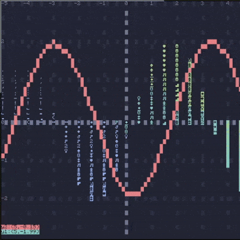

## A tool for rendering graphs in CC:Tweaked  
this library's goal is to provide a simple interface for graphing a bunch of points,  
right now only 2d plotting is supported.  
  
> this uses ComBox for the rendering.   
## Exemple

